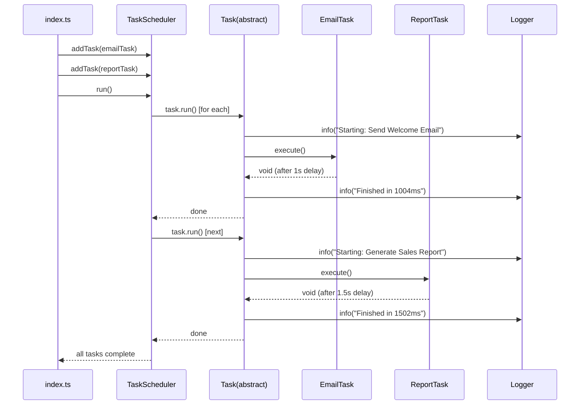

# NEETCODE — ts103: Task Automator Engine

## N — Nature / Overview

A lightweight job scheduler demonstrating OOP principles: classes, access modifiers, inheritance, abstract classes, polymorphism.

**Role**: Introduces TypeScript's OOP capabilities. First project with multi-folder organization (base/, scheduler/, tasks/, utils/).

---

## E — Execution Flow (Sequence Diagram)



---

## E — Edge Cases

| Scenario | Handling |
|----------|----------|
| Task execution throws | Caught in `Task.run()`, logged via Logger, error not re-thrown |
| Async execution delays | All tasks use `async/await` — scheduler waits for each |
| Empty task queue | Scheduler runs successfully with no tasks |
| Task timing accuracy | Uses `Date.now()` diff within `run()` wrapper |

---

## T — Type System & Complexity

**Type constructs**: `abstract class`, `protected`/`private` modifiers, `Promise<void>`, method overrides

**Time complexity**: O(n) where n = number of tasks (sequential execution)

**Space complexity**: O(n) for task queue

---

## C — Core Patterns (Design Patterns)

| Pattern | Usage |
|---------|-------|
| **Template Method** | `Task.run()` defines skeleton; subclasses implement `execute()` |
| **Polymorphism** | `TaskScheduler` works with any `Task` subclass |
| **Abstract Base Class** | `Task` enforces contract via abstract `execute()` |
| **Sequential Iterator** | Scheduler iterates queue in order |

---

## O — Optimization Notes

- Sequential execution is simple but slow for long-running tasks — consider concurrent execution with Promise.all
- No task prioritization — add priority queue pattern
- No persistence — tasks are lost on restart
- No cron scheduling — manual trigger only

---

## D — Dependencies & Config

| Dependency | Version | Purpose |
|------------|---------|---------|
| TypeScript | ^5.6.3 | Compiler |
| ts-node | Latest | Direct execution |
| Jest + ts-jest | 29.x | Testing |

---

## E — Evaluation / Testing

```
npm test     → Task + TaskScheduler tests pass
npm start    → Runs demo with 3 tasks
npm run build → tsc compiles cleanly
```

**Tests cover**: successful execution, error handling in `execute()`, scheduler orchestration.
